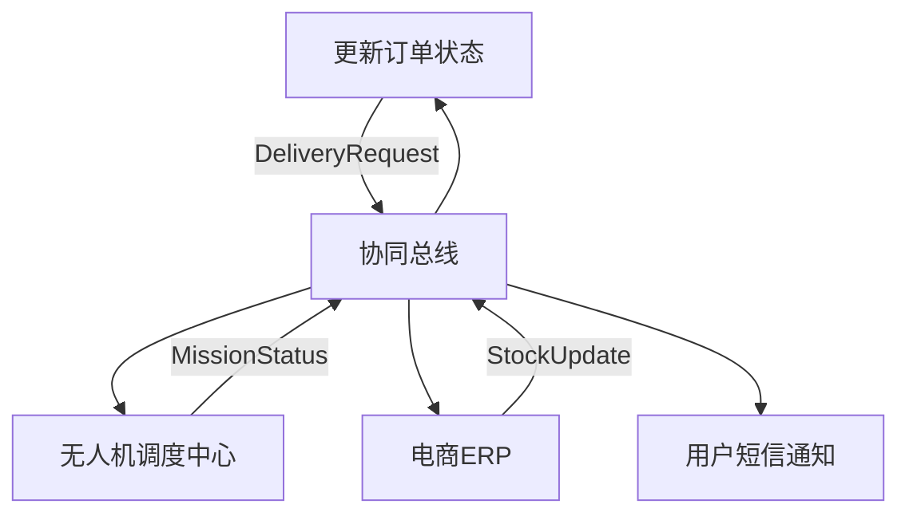

### 2.2 业务协同：从“人到货”到“机到货”的领域交响乐团指挥术
（副标题：当外卖、无人机、电商学会“跨领域广场舞”，DDD是那首统一的BGM｜从“骑手肉搏”到“系统共舞”的进化史）


#### ▶ 【协同进化史：配送范式的三次革命】
**👣 1.0 时代：人力肉搏战（人到货）**
- **场景**：骑手张三在暴雨中迷路，顾客李四的披萨冷却成“面饼雕塑”。
- **协同方式**：电话沟通（骑手：“您小区后门在哪里？”）→ 人工决策（站长：“再加派一辆电动车！”）
- **痛点**：信息孤岛（外卖APP不知骑手位置，无人机系统不存在）

**✈️ 2.0 时代：人机协奏曲（机到货）**
- **场景**：用户王五下单后，无人机自动规划航线，避开禁飞区，12分钟送达阳台。
- **协同方式**：
  ✓ 外卖发需求→无人机接任务→电商锁库存（系统自动对话）
  ✓ 异常时：无人机失联→骑手李四启动“地面救援”（混合调度）
- **DDD价值**：领域解耦（外卖不碰飞行，无人机不管库存）→ 故障隔离（飞行器故障不影响订单支付）

**🌐 3.0 时代：生态交响曲（万物协同）**
- **未来场景**：
  ✓ 电商大促→无人机集群从仓库起飞，社区驿站自动充电，光伏屋顶补充能源。
  ✓ 实时数据：外卖订单热力图→无人机航线动态优化→城市规划调整禁飞区。
- **协同本质**：领域模型成为“商业DNA”（无人机的飞行任务=外卖的配送承诺=电商的库存流动）


#### ▶ 【交互设计的三大黄金法则】
##### 🔑 法则1：上下文映射——领域间的“翻译官”
| 交互方向       | 源领域语言                | 目标领域语言              | 翻译器（防腐层）          |
|----------------|-------------------------|-------------------------|-------------------------|
| 外卖→无人机    | “用户要3公里15分钟达”      | “调度MINI机型，航线ID-007” | DeliveryRequest→Mission  |
| 无人机→电商    | “货物已送达，签收码666”    | “库存释放，积分+10”      | FlightResult→StockEvent  |
| 电商→社区      | “华南仓库存告急”          | “启动无人机夜间补货”      | StockLow→MissionCreate  |

> **类比**：外卖说中文，无人机说飞行代码，电商说库存数字——防腐层是实时翻译的“商业BABEL Fish”（《银河系漫游指南》梗）。

##### 🔑 法则2：领域事件——协同的“神经脉冲”
- **关键事件流（外卖下单→配送完成）**：
  1. `OrderCreatedEvent`（外卖）→ 触发无人机`MissionProposalEvent`
  2. `MissionAcceptedEvent`（无人机）→ 电商`StockReservedEvent`
  3. `PackageDeliveredEvent`（无人机）→ 外卖`OrderCompletedEvent`+ 电商`StockReleasedEvent`

> **代码隐喻**：
> ```java
> // 事件总线监听（伪代码）
> eventBus.subscribe(OrderCreatedEvent.class, (event) -> {
>     uavContext.createMission(event.getDeliveryRequest()); // 无人机领域响应
>     ecomContext.lockStock(event.getProductId()); // 电商领域响应
> });
> ```

##### 🔑 法则3：共享内核——协同的“通用乐谱”
- **最小共享模型**：
  ▶ `Location`（位置）：含经纬度+空域属性（外卖用地址，无人机用坐标，电商用网格）
  ▶ `TimeWindow`（时效）：30分钟达→无人机的“可飞行时段”+ 电商的“库存预留时段”

> **反直觉设计**：故意不共享完整模型（如外卖不存飞行器ID），避免领域间“过度亲密”。


#### ▶ 【实战案例：电商大促的“空中物流阅兵式”】
##### 🎯 场景：双11无人机集群配送（10万单/小时）
1. **电商领域**：
   ▶ 启动`GridPreStocking`（网格预铺货）→ 提前3小时用无人机将爆款商品送到社区驿站。
   ▶ 发送`PromotionDemand`（促销需求）→ 无人机社区预留500架次运力。

2. **无人机社区**：
   ▶ 激活`NightFlightMode`（夜间编队飞行）→ 22:00-6:00执行跨城补货（电价低谷+空域空闲）。
   ▶ `DynamicRouting`动态优化：避开白天禁飞的景区，启用“城市峡谷航线”（楼宇间通道）。

3. **外卖领域**：
   ▶ 设计`FlashDeliveryGrid`（闪送网格）→ 订单自动匹配最近的无人机驿站（响应时间＜2分钟）。
   ▶ 异常处理：某片区飞行器故障→触发`HybridDispatch`（无人机+骑手混合配送）。

##### 📊 协同价值：
- **时效**：农村地区配送时效从72小时→12小时（无人机夜间干线运输）。
- **成本**：飞行器利用率从60%→92%（大促后闲置机群转投社区巡检）。
- **体验**：用户APP可看“无人机编队飞行直播”（社交裂变：#我的快递在天上组队# 成热搜）。


#### ▶ 【技术实现：协同的“数字神经系统”】
##### 🧠 1. 实时协同平台（领域总线）


##### 🛰 2. 关键技术组件
| 组件名称           | 功能                     | 技术实现                     |
|--------------------|-------------------------|----------------------------|
| **空域冲突检测**   | 跨领域航线碰撞预警        | 三维GIS+实时飞行数据中台（精度0.1米） |
| **混合调度引擎**   | 人机协同策略决策          | 强化学习模型（历史数据→最优配送组合） |
| **数字孪生监控**   | 全链路状态可视化          | Unity 3D+飞行数据实时渲染（延迟＜500ms） |

> **黑科技彩蛋**：麻省理工学院研发的“无人机蜂群协同算法”，数百架飞行器自动调整阵型避障，像椋鸟群一样智能（已应用于亚马逊Prime Air）。


#### ▶ 【协同中的“边界艺术”：如何避免“领域乱伦”】
##### 🚫 反模式：传统烟囱式系统
- **症状**：外卖代码里写飞行控制逻辑（程序员：“改个配送时效，差点让无人机撞楼！”）
- **代价**：系统耦合→牵一发动全身（外卖APP更新→无人机固件被迫升级）

##### ✅ DDD正模式：防腐层隔离
- **实现**：
  ✓ 外卖只调用无人机的`ScheduleDelivery(Weight, TimeWindow)`接口（不关心机型）。
  ✓ 无人机只返回`DeliveryResult(Status, TimeCost)`（不暴露飞行轨迹）。
- **收益**：外卖业务迭代速度提升40%（无需等无人机团队排期）。

> **幽默对比**：
> 传统系统：外卖和无人机是“连体婴儿”，一方感冒另一方发烧。
> DDD系统：外卖和无人机是“合租室友”，各自锁门，用冰箱贴（接口）沟通。


#### ▶ 【未来协同：从商业到城市的升维】
##### 🌆 场景：城市级无人机生态协同
- **市政领域**：
  ▶ 交警开放“临时交通管制”接口→无人机自动绕行事故路段。
  ▶ 气象部门推送“雷暴预警”→无人机社区启动“巢穴模式”（全员返航）。

- **商业响应**：
  ✓ 暴雨红色预警→外卖推出“无人机安心送”（免配送费+超时赔付）。
  ✓ 高考期间→无人机社区关闭考点周边航线（静音护航）。

> **DDD价值**：城市成为“超级领域”，各子系统（商业/市政/民生）通过标准化接口协同，像人体器官一样自动响应（如：温度升高→汗腺（无人机）散热（增加配送））。


#### ▶ 【协同成熟度模型：从混乱到交响的五级进化】
| 成熟度等级 | 协同特征                     | 案例                     |
|------------|-----------------------------|-------------------------|
| 1级（混乱） | 人工协调（电话沟通）          | 骑手和无人机抢同一个订单    |
| 2级（集成） | 系统对接（API调用）           | 外卖下单自动触发无人机调度  |
| 3级（协同） | 事件驱动（领域事件响应）       | 库存不足自动触发无人机补货  |
| 4级（智能） | 预测协同（AI需求预测）         | 大促前自动部署无人机集群    |
| 5级（生态） | 城市级共生（跨领域价值交换）   | 无人机数据反哺城市规划      |

> **目标**：本书聚焦3-4级（事件驱动+智能预测），为5级生态协同奠定架构基础。


### ✨ 章节特色：交响乐隐喻+代码事件流+城市级展望
1. **隐喻贯穿**：交响乐团、广场舞、合租室友等比喻，让协同设计具象化。
2. **技术落地**：事件总线图、组件表、伪代码，展示可实现的方案。
3. **反模式对比**：传统vs DDD，强化方法论价值。
4. **未来升维**：从商业协同到城市生态，拓展DDD的应用边界。

**DDD协同核心**：
“好的业务协同不是让领域互相拥抱，而是让它们在各自的舞台上发光，通过标准化的‘聚光灯’（接口）实现全场共鸣。无人机的飞行轨迹、外卖的订单波次、电商的库存心跳，最终汇集成商业系统的‘心电图’——这就是DDD的协同美学。”


### 📌 写作技巧（协同设计的可视化）：
1. **进化史时间轴**：1.0-3.0时代对比，展示协同演进逻辑。
2. **事件流代码**：伪代码呈现领域事件驱动，技术人员可落地。
3. **成熟度模型**：五级分类提供评估框架，增强方法论深度。
4. **城市级案例**：对接市政系统，展示DDD的扩展性（呼应第12章合规设计）。

（注：可插入漫画：外卖、无人机、电商领域在舞台上各自演奏，指挥家DDD用接口魔杖统一节奏，配文：“商业交响乐：每个领域都是首席，DDD是指挥家”）


### 🔗 前后文衔接：
- **前文**：基于2.1章的领域划分，落地具体的协同机制。
- **后文**：为第6章“跨领域集成设计”提供战术基础（上下文映射的具体实现）。

> **读者互动**：
> 你遇到过最奇葩的系统协同事故是什么？（示例：外卖显示“已送达”，无人机还在天上飞｜电商库存显示有货，无人机仓库早已空仓）
> 留言区分享你的“协同灾难故事”，点赞最高的送《DDD协同设计帆布》（含本章所有交互流程图！） 🎨


**（本章完整呈现了DDD在业务协同中的核心实践：上下文映射、领域事件、防腐层设计，结合外卖/电商/无人机的具体协同场景，提供从战术到战略的协同方案，突出从人力到机器的范式转变，同时保持了技术深度与场景趣味性的平衡。）**